# Hệ thống Đấu giá Trực tuyến eBid - Nhóm 4 (LTNC)

Chào mừng mọi người đến với **eBid** - Hệ thống Đấu giá Trực tuyến thời gian thực (Real-time Online Auction Platform) được thiết kế và phát triển bởi **Nhóm 4** cho học phần **Lập trình nâng cao (LTNC)**. 

Dự án này là kết tinh của việc ứng dụng các nguyên lý lập trình hướng đối tượng (OOP) nâng cao, thiết kế giao thức mạng đồng bộ qua Socket TCP, mô hình cơ sở dữ liệu cục bộ an toàn và giao diện đồ họa người dùng hiện đại, tinh tế.

---

## Bảng mục lục
1. [Giới thiệu Dự án & Thành viên](#1-giới-thiệu-dự-án--thành-viên)
2. [Đặc tả Kỹ thuật (Tech Stack)](#2-đặc-tả-kỹ-thuật-tech-stack)
3. [Kiến trúc Đa Phân hệ (Multi-module Architecture)](#3-kiến-trúc-đa-phân-hệ-multi-module-architecture)
4. [Sơ đồ Lớp & Thiết kế OOP (Class Diagram)](#4-sơ-đồ-lớp--thiết-kéo-oop-class-diagram)
5. [Ứng dụng các Mẫu thiết kế (Design Patterns)](#5-ứng-dụng-các-mẫu-thiết-kế-design-patterns)
6. [Mô hình Cơ sở dữ liệu SQLite (Database Schema) & Cơ chế Seeding](#6-mô-hình-cơ-sở-dữ-liệu-sqlite-database-schema--cơ-cế-seeding)
7. [Giao thức truyền thông Custom TCP Socket & JSON](#7-giao-thức-truyền-thông-custom-tcp-socket--json)
8. [Phân tích Thuật toán & Tính năng Nâng cao Cốt lõi](#8-phân-tích-thuật-toán--tính-năng-nâng-cao-cốt-lõi)
9. [Cơ chế Đóng gói Fat JAR & Giải quyết Lỗi JavaFX Runtime](#9-cơ-chế-đóng-gói-fat-jar--giải-quyết-lỗi-javafx-runtime)
10. [Hướng dẫn Biên dịch & Đóng gói (Build Fat JAR)](#10-hướng-dẫn-biên-dịch--đóng-gói-build-fat-jar)
11. [Hướng dẫn Khởi chạy Hệ thống](#11-hướng-dẫn-khởi-chạy-hệ-thống)
12. [Cẩm nang Kiểm thử Hệ thống (Test Cases & Scenarios)](#12-cẩm-nang-kiểm-thử-hệ-thống-test-cases--scenarios)
13. [Cấu trúc thư mục nguồn chi tiết (Directory Tree)](#13-cấu-trúc-thư-mục-nguồn-chi-tiết-directory-tree)
14. [Đặc tả Giao thức JSON Socket (Internal API Specifications)](#14-đặc-tả-giao-thức-json-socket-internal-api-specifications)
15. [Xử lý Lỗi & Khắc phục sự cố (Troubleshooting & FAQs)](#15-xử-lý-lỗi--khắc-phục-sự-cố-troubleshooting--faqs)
16. [Hướng dẫn Đóng góp Mã nguồn (Contributing Guidelines)](#16-hướng-dẫn-đóng-góp-mã-nguồn-contributing-guidelines)
17. [Tài liệu Báo cáo & Video Demo (BẮT BUỘC)](#17-tài-liệu-báo-cáo--video-demo-bắt-buộc)

---

## 1. Giới thiệu Dự án & Thành viên

**eBid** cung cấp một sàn đấu giá trực tuyến hoàn chỉnh, nơi Người bán (Seller) có thể đăng bán các sản phẩm và thiết lập thời gian đóng phiên, Người mua (Bidder) có thể duyệt tìm, xem biểu đồ biến động giá và đấu thầu cạnh tranh trực tiếp dưới sự điều phối nghiêm ngặt của Quản trị viên (Admin).

### Thành viên Nhóm phát triển (Group 4):
*   **Nguyễn Bá Dũng** (Trưởng Nhóm): 
    *   *Nhiệm vụ:* Thiết kế kiến trúc tổng thể, xây dựng Socket Server, thiết kế và tối ưu cơ sở dữ liệu SQLite, phát triển toàn bộ UI/UX bằng JavaFX & CSS tùy biến (Custom CSS Styling) cho Client, hiện thực hóa các tính năng cốt lõi (Auto-Bid, Anti-sniping, Real-time Graph).
*   **Lê Quốc Giang**: 
    *   *Nhiệm vụ:* Xây dựng hệ thống Command Handler tại Server, điều phối logic xử lý lệnh của người dùng, kiểm soát tính nhất quán của luồng nghiệp vụ.
*   **Đinh Đức Hiếu**: 
    *   *Nhiệm vụ:* Thiết kế layout các màn hình FXML, quản lý điều hướng giữa các phân vùng giao diện người dùng (Login, SignUp, Dashboard).
*   **Nguyễn Duy Anh**: 
    *   *Nhiệm vụ:* Phát triển phân lớp truy xuất cơ sở dữ liệu (DAO), viết các câu lệnh SQL tối ưu hóa việc truy vấn giao dịch đấu giá và đồng bộ dữ liệu.

---

## 2. Đặc tả Kỹ thuật (Tech Stack)

Hệ thống được phát triển dựa trên những công nghệ chuẩn mực và mạnh mẽ:
*   **Ngôn ngữ chính:** **Java 25** (Tận dụng các tính năng hiện đại như Pattern Matching, Records, Text Blocks nâng cao).
*   **Giao diện người dùng:** **JavaFX 26 (FXML + Vanilla CSS)**. Giao diện được thiết kế theo phong cách tối giản hiện đại (Modern Premium Minimalism) với hiệu ứng kính mờ (Glassmorphism), bóng đổ mềm, bảng màu HSL hài hòa và biểu đồ động.
*   **Cơ sở dữ liệu:** **SQLite 3.45+** (Embedded Serverless DB). Lưu trữ dữ liệu cục bộ dưới dạng tệp đơn độc `auction_system.db`. Không đòi hỏi người vận hành cấu hình máy chủ DB rời, tự động tạo cấu trúc và mồi dữ liệu mẫu (Seeding) ngay khi Server bắt đầu.
*   **Cơ chế truyền thông:** **TCP Socket** nguyên bản kết hợp đa luồng bất đồng bộ (Asynchronous Multi-threading). Dữ liệu được tuần tự hóa (Serialization) sang chuẩn JSON thông qua thư viện **Google Gson 2.10.1** để truyền tải qua mạng.
*   **Build Tool:** **Maven 3.8+** phục vụ quản lý thư viện phụ thuộc và cấu hình quy trình đóng gói đa phân hệ.

---

## 3. Kiến trúc Đa Phân hệ (Multi-module Architecture)

Dự án tuân thủ kiến trúc chia tách trách nhiệm (Separation of Concerns) với mô hình đa module Maven:

```
                  ┌──────────────────┐
                  │  auction-shared  │  <── Chứa Models & Tiện ích chung
                  └────────┬─────────┘
                           │ (Dependency)
             ┌─────────────┴─────────────┐
             ▼                           ▼
┌──────────────────┐       ┌──────────────────┐
│  auction-server  │       │  auction-client  │
│ (SQLite, Socket) │       │ (JavaFX, Client) │
└──────────────────┘       └──────────────────┘
```

*   **`auction-shared`**: Chứa các lớp định nghĩa thực thể mô hình dữ liệu (`User`, `Item`, `Auction`, `BidTransaction`,...) và cấu hình mạng dùng chung. Lớp này được hai module còn lại import làm thư viện phụ thuộc cốt lõi.
*   **`auction-server`**: Bộ não điều khiển trung tâm. Module này khởi chạy cổng TCP lắng nghe các Client, quản lý luồng cơ sở dữ liệu SQLite cục bộ, kiểm soát vòng đời các phiên đấu giá và điều phối các tác vụ ngầm tự động.
*   **`auction-client`**: Lớp biểu diễn tương tác. Module này kết nối Socket đến Server và tiếp nhận phản hồi để hiển thị lên màn hình JavaFX, đồng thời thu thập cử chỉ hành vi của người dùng truyền tải về máy chủ.

---

## 4. Sơ đồ Lớp & Thiết kế OOP (Class Diagram)

Hệ thống được mô hình hóa hướng đối tượng chặt chẽ. Toàn bộ thiết kế cấu trúc lớp được định nghĩa chi tiết trong tệp [online-auction-system.puml](file:///f:/LTNC/Bai7/Project-LTNC-Group-4/online-auction-system.puml) và đã được xuất thành tệp hình ảnh sơ đồ chất lượng cao [online-auction-system.png](file:///f:/LTNC/Bai7/Project-LTNC-Group-4/online-auction-system.png).

### Các điểm nhấn trong thiết kế đối tượng & Nguyên lý OOP:

#### 1. Tính Kế thừa & Đa hình (Inheritance & Polymorphism):
*   **Thành phần Người dùng (`User`):** Lớp cha trừu tượng `User` được định nghĩa với các trường cốt lõi (`username`, `password`, `email`, `role`). Các thực thể con bao gồm `Bidder` (Người đấu thầu), `Seller` (Người bán) và `Admin` (Quản trị viên) kế thừa trực tiếp từ `User`, cho phép hệ thống quản lý danh tính đồng bộ và xử lý đa hình trong phân quyền.
*   **Thành phần Sản phẩm (`Item`):** Lớp cha trừu tượng `Item` định nghĩa các thuộc tính cơ sở (`id`, `name`, `description`, `startingPrice`, `startTime`, `endTime`, `currentHighestPrice`, `imageUrls`). Các danh mục sản phẩm cụ thể kế thừa `Item` bao gồm:
    *   `Electronics`: Bổ sung thuộc tính `warrantyMonths` (Thời gian bảo hành).
    *   `Vehicle`: Bổ sung thuộc tính `brand` (Hãng sản xuất/Thương hiệu xe).
    *   `Art`: Bổ sung thuộc tính `artistName` (Tên danh họa/Nghệ sĩ sáng tác).
    *   `GeneralItem`: Mặt hàng thông thường không có thuộc tính bổ sung phức tạp.
*   **Ý nghĩa thực tiễn:** Việc thiết kế đa hình giúp Server và Client xử lý các loại hàng hóa khác nhau thông qua kiểu dữ liệu tổng quát `Item`, đồng thời dễ dàng ép kiểu xuống các lớp con chuyên biệt khi cần trích xuất thông tin đặc thù.

```
                   ┌───────────────────────┐
                   │    <<abstract>>       │
                   │        User           │
                   └──────────┬────────────┘
         ┌────────────────────┼───────────────────┐
         ▼                    ▼                   ▼
┌─────────────────┐  ┌─────────────────┐  ┌───────────────┐
│     Bidder      │  │     Seller      │  │     Admin     │
└─────────────────┘  └─────────────────┘  └───────────────┘

                   ┌───────────────────────┐
                   │    <<abstract>>       │
                   │        Item           │
                   └──────────┬────────────┘
         ┌────────────────────┼───────────────────┬───────────────────┐
         ▼                    ▼                   ▼                   ▼
┌─────────────────┐  ┌─────────────────┐  ┌───────────────┐  ┌────────────────┐
│   Electronics   │  │     Vehicle     │  │      Art      │  │  GeneralItem   │
└─────────────────┘  └─────────────────┘  └───────────────┘  └────────────────┘
```

#### 2. Tính Đóng gói (Encapsulation):
Mọi thuộc tính của các thực thể (`User`, `Item`, `Auction`, `BidTransaction`, `AutoBid`) đều được khai báo với phạm vi truy cập `private` hoặc `protected` để ngăn chặn các sửa đổi trạng thái ngoài ý muốn từ bên ngoài. Các trường dữ liệu nhạy cảm được truy xuất và cập nhật an toàn thông qua các phương thức Getter/Setter tương ứng có tích hợp logic kiểm duyệt dữ liệu đầu vào.

#### 3. Tính Trừu tượng (Abstraction):
Bản thân các thực thể nền tảng `User` và `Item` đều là các lớp trừu tượng (`abstract class`). Chúng đại diện cho các khái niệm chung và không thể khởi tạo trực tiếp thông qua từ khóa `new`. Các lớp này định hình khuôn mẫu chuẩn cho các phân hệ cụ thể mở rộng phía sau.

---

## 5. Ứng dụng các Mẫu thiết kế (Design Patterns)

Nhóm 4 đã áp dụng thực tiễn nhiều mẫu thiết kế kinh điển giúp mã nguồn linh hoạt, dễ mở rộng và đạt chuẩn mực công nghiệp:

### 5.1. Singleton Pattern (Mẫu đơn thể)
Áp dụng cho các lớp quản lý bộ nhớ đệm và điều phối nghiệp vụ ở phía Server để đảm bảo tính duy nhất và nhất quán của dữ liệu trên toàn hệ thống, tránh việc tạo ra nhiều thực thể trùng lặp tiêu tốn RAM và xung đột logic:
*   `ItemManager.getInstance()`: Quản lý danh mục sản phẩm duy nhất trong bộ nhớ máy chủ.
*   `UserManager.getInstance()`: Điều phối thông tin các tài khoản đang hoạt động.
*   `AuctionManager.getInstance()`: Đảm bảo chỉ duy nhất một luồng điều phối đấu thầu và đồng hồ đếm ngược phiên đấu giá tồn tại.
*   `CommandRouter.getInstance()`: Bộ định tuyến lệnh duy nhất trên Server.

*Minh họa mã nguồn triển khai Singleton Thread-safe trong `AuctionManager`:*
```java
public class AuctionManager {
    private static AuctionManager instance;
    
    private AuctionManager() {
        activeAuctions = new ConcurrentHashMap<>();
        orderDAO = new OrderDAO();
    }

    public static synchronized AuctionManager getInstance() {
        if (instance == null) {
            instance = new AuctionManager(); // Khởi tạo trì hoãn (Lazy Initialization)
        }
        return instance;
    }
}
```

### 5.2. Observer Pattern (Mẫu quan sát)
Giải quyết triệt để bài toán cập nhật thời gian thực không đồng bộ (Real-time Broadcast). Khi có biến động giá thầu mới hoặc thời gian thay đổi, Server sẽ phát sóng cập nhật lập tức tới mọi Client đang trực tuyến mà không cần các Client phải gửi yêu cầu liên tục (Polling).
*   **Subject:** `AuctionSubject` (Định nghĩa các phương thức đăng ký, gỡ bỏ và thông báo tới các Observer).
*   **Observer:** `AuctionObserver` (Interface định nghĩa phương thức tiếp nhận bản tin mạng).
*   **Concrete Observer:** `ClientHandler` (Mỗi kết nối của Client là một tiến trình quản lý Socket riêng biệt. Khi kết nối thành công, `ClientHandler` được đăng ký vào danh sách của `AuctionSubject`. Mỗi khi Server có cập nhật giá hay trạng thái, nó sẽ duyệt qua danh sách và ghi dữ liệu ra luồng Socket của từng `ClientHandler`).

```
┌──────────────┐          1. Đăng ký kết nối           ┌───────────────┐
│ Client (1)   ├──────────────────────────────────────>│               │
├──────────────┤                                       │               │
│ Client (2)   ├──────────────────────────────────────>│ AuctionServer │
└──────────────┘                                       │ (Subject)     │
       ▲                                               │               │
       │ 2. Broadcast JSON khi có sự thay đổi giá thầu  │               │
       └───────────────────────────────────────────────┤               │
                                                       └───────────────┘
```

### 5.3. Command Pattern (Mẫu lệnh)
Mẫu thiết kế đóng vai trò là kiến trúc nền tảng cho giao tiếp mạng Client-Server. Loại bỏ hoàn toàn các cấu trúc `if-else` lồng nhau phức tạp khi phân tích các gói tin thô từ Socket.
*   **Interface `Command`:** Định nghĩa phương thức chuẩn `execute(JsonObject requestData, PrintWriter out, ClientHandler handler)`.
*   **Concrete Commands:** Các lớp thực thi nghiệp vụ chi tiết bao gồm `LoginCommand`, `BidCommand`, `AutoBidCommand`, `CancelAutoBidCommand`, `AddItemCommand`, `DeleteItemCommand`, `GetSellerDashboardCommand`, `AdminCommand`...
*   **Invoker/Router (`CommandRouter`):** Chứa bản đồ `HashMap<String, Command>`. Khi nhận được gói JSON dạng `{"command": "TÊN_LỆNH", "data": {...}}`, Router sẽ tìm kiếm lớp xử lý tương ứng trong bản đồ với độ phức tạp thuật toán cực kỳ tối ưu là $O(1)$ và thực thi lệnh.

```
                        ┌───────────────────┐
                        │   CommandRouter   │
                        └─────────┬─────────┘
                                  │ Tra cứu O(1)
                                  ▼
                        ┌───────────────────┐
                        │    <<interface>>  │
                        │      Command      │
                        └─────────┬─────────┘
         ┌────────────────────────┼────────────────────────┐
         ▼                        ▼                        ▼
┌─────────────────┐      ┌─────────────────┐      ┌─────────────────┐
│  LoginCommand   │      │   BidCommand    │      │ AddItemCommand  │
└─────────────────┘      └─────────────────┘      └─────────────────┘
```

### 5.4. Factory Method Pattern (Mẫu nhà máy)
Được triển khai thông qua lớp `ItemFactory` đóng vai trò là điểm khởi dựng duy nhất (Single Point of Instantiation) cho cấu trúc đa hình của sản phẩm `Item`.
*   **Mục tiêu thiết kế:** Che giấu logic tạo lập phức tạp của các lớp con (`Electronics`, `Art`, `Vehicle`, `GeneralItem`).
*   **Cơ chế phòng thủ lỗi (Defensive Parsing):** Trong `ItemFactory.createItem()`, thuộc tính mở rộng `extraInfo` được bóc tách an toàn. Ví dụ đối với sản phẩm điện tử, số tháng bảo hành được parse từ chuỗi sang số nguyên bao bọc trong khối `try-catch` đề phòng lỗi định dạng `NumberFormatException`, nếu xảy ra lỗi sẽ tự động đưa về giá trị mặc định là 0 thay vì làm crash Server.

### 5.5. DAO Pattern (Data Access Object)
Tách biệt hoàn toàn tầng logic nghiệp vụ của Server ra khỏi tầng dữ liệu SQL thô.
*   Các lớp `UserDAO`, `ItemDAO`, `OrderDAO` đảm nhận nhiệm vụ mở kết nối JDBC, chuẩn bị các câu lệnh `PreparedStatement` an toàn, thực thi truy vấn và ánh xạ kết quả (ORM thủ công) thành các đối tượng Java thuần túy.

---

## 6. Mô hình Cơ sở dữ liệu SQLite (Database Schema) & Cơ chế Seeding

Hệ thống sử dụng cơ sở dữ liệu cục bộ SQLite, toàn bộ cấu trúc bảng và dữ liệu mẫu được khởi tạo tự động thông qua lớp `DBConnection.java`.

### 6.1. Chi tiết cấu trúc các bảng (DDL):

#### 1. Bảng Người dùng (`users`)
Lưu trữ danh tính người dùng, mật khẩu thô (hoặc băm), email và vai trò phân quyền trên sàn.
```sql
CREATE TABLE IF NOT EXISTS users (
    id INTEGER PRIMARY KEY AUTOINCREMENT,
    username TEXT UNIQUE NOT NULL,
    password TEXT NOT NULL,
    email TEXT NOT NULL,
    role TEXT NOT NULL,         -- Vai trò: 'BIDDER', 'SELLER', 'ADMIN'
    isLocked INTEGER DEFAULT 0, -- 0: Hoạt động bình thường, 1: Tài khoản bị khóa
    isVerified INTEGER DEFAULT 0
);
```

#### 2. Bảng Sản phẩm (`items`)
Lưu trữ thông tin chi tiết của từng mặt hàng được đăng ký tham gia sàn đấu giá.
```sql
CREATE TABLE IF NOT EXISTS items (
    id TEXT PRIMARY KEY,
    name TEXT NOT NULL,
    description TEXT,
    starting_price REAL NOT NULL,
    start_time TEXT NOT NULL, -- Định dạng ISO 8601 String
    end_time TEXT NOT NULL,   -- Định dạng ISO 8601 String
    type TEXT NOT NULL,       -- Thể loại: 'ELECTRONICS', 'VEHICLE', 'ART', 'GENERAL'
    extra_info TEXT,          -- Thuộc tính mở rộng đặc hữu của từng loại con
    seller_name TEXT,         -- Liên kết người sở hữu
    image_urls TEXT           -- Chuỗi đường dẫn hình ảnh minh họa sản phẩm
);
```

#### 3. Bảng Đơn hàng thắng cuộc (`orders`)
Hóa đơn lưu vết lịch sử giao dịch thành công khi một phiên đấu giá hoàn thành thời gian chạy và có người chiến thắng hợp lệ.
```sql
CREATE TABLE IF NOT EXISTS orders (
    order_id INTEGER PRIMARY KEY AUTOINCREMENT,
    item_id TEXT,
    seller_name TEXT,
    bidder_name TEXT,
    final_price REAL,
    order_date DATE DEFAULT (DATE('now'))
);
```

### 6.2. Cơ chế Data Seeding (Tự động nạp dữ liệu mồi):
Để dự án luôn sẵn sàng chạy thử nghiệm E2E ngay lập tức mà không cần bất cứ thao tác cài cắm dữ liệu ban đầu nào, hệ thống thực hiện hai luồng Seeding thông minh:
1.  **Mồi tài khoản mặc định:** Trong phương thức `createTablesAndDefaultUsers()`, hệ thống đếm số lượng bản ghi bảng `users`. Nếu bảng trống (`COUNT == 0`), Server sẽ tự động chèn vào 4 tài khoản mặc định đại diện cho cả 3 vai trò (`Admin_01`, `Seller_01`, `Bidder_01`, `Bidder_02`).
2.  **Mồi 20 sản phẩm mẫu đa dạng:** Trong `MainServer.java`, hệ thống tự động sinh ra 20 sản phẩm mẫu (với các mức giá khởi điểm tăng dần đều từ $1,100,000$ ₫ đến $3,000,000$ ₫) thuộc sở hữu của người bán mặc định `user1`.
3.  **Cơ chế chống trùng lặp dữ liệu (Anti-duplication check):** Trước khi nạp các sản phẩm mẫu này vào SQLite và bộ nhớ RAM, Server sử dụng Java Stream API quét đối chiếu ID sản phẩm (`item_user1_i`) trong `ItemManager`. Cơ chế này loại bỏ hoàn toàn lỗi khóa chính (`UNIQUE constraint failed`) khi quản trị viên khởi chạy lại Server nhiều lần trên cùng một tệp cơ sở dữ liệu.

---

## 7. Giao thức truyền thông Custom TCP Socket & JSON

Toàn bộ hệ thống giao tiếp qua mạng dựa trên giao thức TCP Socket nguyên bản, đảm bảo dữ liệu truyền tải tin cậy và theo đúng thứ tự. 

### 7.1. Cơ chế Serialization & Deserialization với Gson:
Lớp tiện ích `GsonConfig.java` thiết lập cấu hình đặc biệt cho bộ thư viện Google Gson để giải quyết hai thách thức lớn trong lập trình mạng của Java:
1.  **Định dạng Java 8 `LocalDateTime`:** Mặc định Gson không hỗ trợ kiểu dữ liệu thời gian mới này của Java 8 và sẽ phân giải nó thành một cấu trúc JSON lồng ghép rất cồng kềnh. `GsonConfig` đăng ký TypeAdapter tùy biến để ép toàn bộ các đối tượng thời gian về chuỗi dẹt chuẩn **ISO-8601** (Ví dụ: `2026-05-18T11:00:00`) và ngược lại.
2.  **Đa hình lớp trừu tượng `Item` (Polymorphic Deserialization):** Do `Item` là một abstract class nên Gson thô không thể khởi tạo nó khi nhận gói tin từ socket. Chúng tôi viết một Custom Deserializer hoạt động như một bộ phân giải dựa trên đặc trưng thuộc tính (Discriminator-based parser):
    *   Nếu JSON có chứa trường `"warrantyMonths"` $\rightarrow$ Đúc thành thực thể `Electronics.class`.
    *   Nếu JSON có chứa trường `"artistName"` $\rightarrow$ Đúc thành thực thể `Art.class`.
    *   Nếu JSON có chứa trường `"brand"` $\rightarrow$ Đúc thành thực thể `Vehicle.class`.
    *   Mặc định chuyển dịch về `Electronics.class` để phòng thủ lỗi crash.

### 7.2. Đặc tả các gói tin JSON thực tế giữa Client và Server:

#### Kịch bản 1: Đăng nhập hệ thống (Login Flow)
*   **Client gửi:**
    ```json
    {
      "command": "LOGIN",
      "data": {
        "username": "Bidder_01",
        "password": "pass123"
      }
    }
    ```
*   **Server trả về (Thành công):**
    ```json
    {
      "status": "SUCCESS",
      "role": "BIDDER",
      "message": "Đăng nhập thành công"
    }
    ```

#### 🧪 Kịch bản 2: Đặt giá thủ công (Manual Bid Flow)
*   **Client gửi:**
    ```json
    {
      "command": "BID",
      "data": {
        "auctionId": "item_user1_1",
        "bidderName": "Bidder_01",
        "amount": 1200000.0
      }
    }
    ```
*   **Server phát sóng Broadcast toàn mạng (AUCTION_UPDATE):**
    ```json
    {
      "command": "UPDATE_PRICE",
      "auctionId": "item_user1_1",
      "price": 1200000.0,
      "winnerUsername": "Bidder_01",
      "message": "[MANUAL] Bidder_01 đã đặt giá 1,200,000 ₫"
    }
    ```

#### Kịch bản 3: Thiết lập Robot đặt thầu tự động (Auto-Bidding Setup)
*   **Client gửi:**
    ```json
    {
      "command": "AUTO_BID",
      "data": {
        "auctionId": "item_user1_3",
        "username": "Bidder_02",
        "maxBid": 2500000.0,
        "increment": 50000.0
      }
    }
    ```
*   **Server phản hồi trực tiếp về Client gửi thầu:**
    ```json
    {
      "status": "SUCCESS",
      "message": "Đã kích hoạt Auto Bid"
    }
    ```

---

## 8. Phân tích Thuật toán & Tính năng Nâng cao Cốt lõi

Hệ thống được nghiên cứu và tối ưu hóa cao độ để xử lý các bài toán nghiệp vụ phức tạp của một sàn đấu giá chuyên nghiệp trong thế giới thực:

### 8.1. Thuật toán Đặt thầu tự động thông minh (Auto-Bidding Engine)
Tính năng cho phép người thầu ủy quyền cho một robot thông minh cắm chốt và tự động trả đũa tăng giá thay thế họ.
*   **Tham số đầu vào:** Ngân sách trần tối đa (`maxBid`) và bước nhảy giá thầu mong muốn (`increment`).
*   **Cơ chế hoạt động bất đồng bộ ngầm (Background Async Thread):** Khi có một lượt đặt giá mới (thủ công hoặc từ bot khác) làm thay đổi người dẫn đầu của một sản phẩm, Server sẽ quét qua danh sách Robot Auto-Bid đã được cắm trên sản phẩm đó. Để không gây tắc nghẽn (freeze) luồng xử lý mạng Socket I/O chính, Server khởi chạy một luồng bất đồng bộ (`new Thread()`) chuyên trách chạy vòng lặp cạnh tranh giữa các Bot.
*   **Độ trễ hành vi người dùng (Human-like Latency):** Thay vì robot nâng giá lập tức trong 0ms (dễ gây nghẽn mạng và tạo cảm giác phi thực tế), luồng Bot sẽ ngủ ngẫu nhiên từ **1.5 giây đến 2.5 giây** trước khi ra đòn phản công.
*   **Phân xử thứ tự ưu tiên (FIFO - First In, First Out):** Nếu có nhiều Bot của nhiều người dùng cùng đăng ký trên một sản phẩm và cùng đủ điều kiện ngân sách nâng thầu, Server sẽ sắp xếp danh sách Bot theo mốc thời gian đăng ký (`registerTime`). Bot nào được cài cắm trước sẽ được quyền đặt giá trước.
*   **Trận chiến Robot đấu giá (Bot Duel):** Vòng lặp thầu tự động sẽ tiếp diễn liên tục cho đến khi mức giá vượt quá ngân sách tối đa của một bên, robot của bên thua cuộc sẽ tự động dừng hoạt động và thông báo về client, giành chiến thắng cho bên còn lại ở mức bước nhảy tối thiểu.

```
      [Thầu mới xuất hiện]
               │
               ▼
   [Quét danh sách Robot] ──(Không có)──> [Dừng luồng]
               │
           (Có robot)
               ▼
   [Sắp xếp FIFO theo thời gian đăng ký]
               │
               ▼
   [Tính giá phản công: P = Current + Increment]
               │
       ┌───────┴───────┐
       ▼               ▼
   (P <= Max Budget)   (P > Max Budget)
       │               │
       ▼               ▼
[Ngủ ngẫu nhiên 1.5-2.5s] [Hủy robot & Báo cạn ví]
       │
       ▼
 [Đặt giá thành công]
 [Phát JSON Broadcast]
       │
       └───────> (Lặp lại vòng quét thầu)
```

### 8.2. Thuật toán Chống bắn tỉa phút chót (Anti-sniping Protection)
Khắc phục triệt để hành vi đầu cơ phi thể thao của các người dùng sử dụng tool tự động ("Sniper") - đợi đến mili-giây cuối cùng trước khi đóng phiên mới nhấn đặt thầu, khiến những người tham gia khác không có cơ hội phản ứng.
*   **Nguyên lý vận hành:** Khi Server tiếp nhận một giá thầu hợp lệ, nó sẽ tính toán khoảng thời gian còn lại đến khi đóng phiên đấu giá:
    $$\Delta t = T_{end} - T_{current}$$
*   **Kích hoạt gia hạn:** Nếu khoảng cách này nhỏ hơn hoặc bằng 30 giây ($\Delta t \le 30$s), Server sẽ tự động đẩy lùi thời gian kết thúc phiên đấu giá kéo dài thêm đúng 60 giây nữa:
    $$T_{new\_end} = T_{current} + 60\text{s}$$
*   **Đồng bộ thời gian thực:** Trạng thái thời gian mới lập tức được lưu bền vững vào SQLite DB thông qua `ItemDAO`, đồng thời Server phát sóng gói tin `UPDATE_TIME` toàn mạng. Giao diện ClientFX của mọi người dùng sẽ tự động kéo dài thêm 1 phút trên thanh đồng hồ đếm ngược một cách mượt mà và trực quan.

### 8.3. Đảm bảo an toàn Đa luồng & Tranh chấp thầu (Concurrency Safety)
*   **Thách thức:** Khi hàng chục Client cùng nhấn nút đặt thầu ở cùng một mili-giây, máy chủ có thể bị tranh chấp tài nguyên (Race Condition), dẫn đến ghi nhận sai giá thầu hoặc một người mua bị mất lượt oan uổng.
*   **Giải pháp:** Mọi hành vi đặt thầu trong `AuctionManager` được bao bọc bởi từ khóa đồng bộ hóa **`synchronized`** trên chính đối tượng phiên đấu giá (`Auction`). Điều này ép các luồng mạng từ các Client khác nhau phải xếp hàng tuần tự. Máy chủ xử lý giá thầu đến trước, cập nhật giá mới làm mốc, và từ chối các giá thầu đến sau nếu chúng thấp hơn hoặc bằng mức giá mới cập nhật này.

### 8.4. Giới hạn tần suất đặt thầu (Spam Throttling / Rate Limiting)
*   **Nguyên lý:** Nhằm ngăn chặn các công cụ Auto-Clicker phá hoại, spam liên tục nút đặt giá làm quá tải luồng xử lý của Socket Server và làm nghẽn DB SQLite, hệ thống triển khai bộ đệm giám sát thời gian thực dạng Epoch Milliseconds.
*   **Cơ chế:** Server duy trì một `ConcurrentHashMap<String, Long>` lưu trữ mốc thời gian đặt thầu gần nhất của từng khóa kết hợp giữa tên tài khoản và ID đấu giá (`username_auctionId`). Khoảng cách tối thiểu bắt buộc giữa hai lượt thầu liên tiếp của cùng một người trên một sản phẩm là **1.5 giây (1500ms)**. Mọi yêu cầu gửi nhanh hơn sẽ bị từ chối thẳng thừng tại Server.

### 8.5. Kỹ thuật Optimistic UI Update & Đồng bộ Dữ liệu Trực quan (Real-time Syncing)
*   **Thách thức:** Khi người mua thực hiện thanh toán hàng loạt hoặc người bán chuyển đổi giữa các tab quản lý, nếu phải chờ Server xử lý I/O cơ sở dữ liệu rồi mới phản hồi thì ứng dụng Client sẽ bị khựng (lag/freeze), mang lại trải nghiệm không mượt mà.
*   **Giải pháp Optimistic UI Update (Client-side):** Tại màn hình Giỏ hàng (Dashboard), ngay khi người dùng nhấn "Xác nhận Thanh toán", hệ thống lập tức giả định giao dịch thành công và cập nhật trạng thái UI sang "Hoàn thành" ở bộ nhớ tạm cục bộ, đồng thời ẩn đi popup giỏ hàng để chuyển cảnh mượt mà trong khi luồng ngầm vẫn đang gửi dữ liệu lên Server qua Socket.
*   **Giải pháp Auto-Refresh Data (Server-sync):** Tại màn hình Người bán (Seller Dashboard), ứng dụng được thiết kế luồng sự kiện thông minh: mỗi khi người dùng click chuyển tab (ví dụ từ "Tổng quan" sang "Sản phẩm đã bán"), Client sẽ tự động mở luồng gọi API nội bộ tải mới dữ liệu thực tế (Real-time Fetching) từ Server, đảm bảo tính nhất quán tuyệt đối của hệ thống sau mỗi giao dịch từ người mua mà không cần nút Refresh thủ công.

### 8.6. Phân tích Luồng Giao tiếp Client-Server Chi tiết (Sequence Diagrams)

Để làm rõ hơn cơ chế hoạt động mạng bên dưới (Under-the-hood), dưới đây là phân tích luồng xử lý cực kỳ chi tiết của 2 nghiệp vụ xương sống trong hệ thống, được mô hình hóa bằng sơ đồ tuần tự (Sequence Diagram):

#### A. Luồng Đặt giá thầu & Cơ chế Phát sóng Toàn mạng (Bidding & Broadcast Flow)
Luồng này thể hiện cách một thao tác nhấp chuột của 1 Bidder có thể ngay lập tức làm thay đổi màn hình của tất cả những người dùng khác đang online thông qua Observer Pattern:

```mermaid
sequenceDiagram
    participant B1 as Bidder 1 (Client)
    participant B2 as Bidder 2 (Client)
    participant CH1 as ClientHandler (Server)
    participant Router as CommandRouter
    participant AM as AuctionManager
    participant DB as SQLite (ItemDAO)
    participant Sub as AuctionSubject

    B1->>CH1: Gửi JSON: {command: "BID", amount: 1500000}
    CH1->>Router: parse(JSON) -> Tìm BidCommand
    Router->>AM: execute(auctionId, bidderName, amount)
    
    rect rgb(40, 40, 60)
        Note over AM,DB: Khối đồng bộ (synchronized)
        AM->>AM: Kiểm tra Rate Limit (1500ms)
        AM->>AM: So sánh: 1500000 > currentPrice ?
        AM->>DB: UPDATE items SET current_price = 1500000
        DB-->>AM: Trả về kết quả Thành công
    end
    
    AM->>Sub: notifyObservers(UpdateData)
    Note over Sub: Duyệt qua tất cả Client đang kết nối
    Sub-->>CH1: Phát gói tin UPDATE_PRICE (cho Bidder 1)
    Sub-->>B2: Phát gói tin UPDATE_PRICE (cho Bidder 2)
    CH1-->>B1: Phản hồi {"status": "SUCCESS"}
    
    B1->>B1: JavaFX Application Thread: Vẽ lại biểu đồ & UI
    B2->>B2: JavaFX Application Thread: Vẽ lại biểu đồ & UI
```



**Phân tích chuyên sâu:**
1. Khi **Bidder 1** gửi lệnh, luồng `ClientHandler` chuyên trách sẽ bóc tách JSON và đẩy vào `CommandRouter` với thời gian tra cứu $O(1)$.
2. Tại `AuctionManager`, luồng xử lý bị khóa (khối xám) bởi từ khóa `synchronized`, đảm bảo nếu **Bidder 2** cùng đặt giá ngay mili-giây đó, luồng của Bidder 2 bắt buộc phải xếp hàng chờ DB ghi xong giá của Bidder 1.
3. `AuctionSubject` kích hoạt cơ chế Observer, duyệt vòng lặp qua mảng Socket đang sống và bơm (push) sự kiện `UPDATE_PRICE` thẳng về máy khách mà không cần máy khách phải liên tục hỏi (polling).

#### B. Luồng Thanh toán Bất đồng bộ & Cập nhật Lạc quan (Optimistic Checkout Flow)
Luồng này bóc tách nguyên lý giúp màn hình chuyển trạng thái cực kỳ mượt mà dù thao tác Database mất nhiều thời gian:

```mermaid
sequenceDiagram
    participant UI as JavaFX Thread (Client)
    participant Socket as Socket Thread (Client)
    participant CH as ClientHandler (Server)
    participant OrderDAO as OrderDAO (SQLite)

    UI->>UI: Người dùng nhấn "Xác nhận & Thanh toán"
    
    rect rgb(40, 60, 40)
        Note over UI: Kỹ thuật Optimistic UI Update
        UI->>UI: Đóng lập tức màn hình Checkout Popup
        UI->>UI: Đổi nhãn "Chờ thanh toán" -> "Hoàn thành"
        UI->>UI: Gắn bộ đếm giờ (Timer) 5 giây
    end

    UI->>Socket: Ủy thác tác vụ mạng: out.println(PAY_WINNINGS)
    Socket->>CH: Gửi JSON thanh toán qua mạng
    CH->>OrderDAO: Thực thi UPDATE orders SET status = 'FINISHED'
    Note over OrderDAO: Thao tác DB tốn thời gian I/O
    OrderDAO-->>CH: Ghi đĩa thành công (Disk Commit)
    CH-->>Socket: JSON {status: SUCCESS}
    
    Note over UI: Sau 5 giây, đếm ngược hoàn tất
    UI->>UI: Chuyển hướng người dùng về màn hình Home
```



**Phân tích chuyên sâu:**
Thay vì để luồng giao diện chính (JavaFX Application Thread) bị khóa cứng chờ đợi `OrderDAO` ghi dữ liệu xuống đĩa cứng vật lý ở máy chủ, Client tự **"lạc quan giả định"** (Optimistic) rằng mạng và Server chắc chắn sẽ thành công. Nhờ đó, thao tác tương tác của con người đạt độ trễ tiệm cận 0ms, làm thỏa mãn triệt để các tiêu chuẩn UX/UI khắt khe nhất trong lập trình Frontend hiện đại.

---

## 9. Cơ chế Đóng gói Fat JAR & Giải quyết Lỗi JavaFX Runtime

Quy trình đóng gói của dự án sử dụng `maven-shade-plugin` nhằm xuất bản ra các tệp JAR hoàn chỉnh, độc lập và chạy được ngay.

### 9.1. Lớp mồi `UILauncher` - Giải pháp giải quyết lỗi JavaFX Runtime:
*   **Bối cảnh lỗi:** Kể từ Java 9+, hệ thống mô-đun hóa (Java Platform Module System - JPMS) được đưa vào vận hành chặt chẽ. Nếu ta chỉ định tệp JAR chạy trực tiếp bằng cách gọi lớp `MainUI` (kế thừa trực tiếp từ `javafx.application.Application`), máy ảo JVM khi khởi chạy sẽ phát hiện lớp JavaFX trên Classpath mà không có cấu hình mô-đun liên kết phù hợp, lập tức ném ngoại lệ và crash hệ thống:
    ```
    Error: JavaFX runtime components are missing, and are required to run this application
    ```
*   **Giải pháp xử lý đột phá:** Chúng tôi tạo ra một lớp trung gian thuần túy có tên `network.UILauncher` nằm tại module Client. Lớp này là một lớp Java tiêu chuẩn, hoàn toàn không kế thừa hay chứa bất kỳ mã nguồn phụ thuộc tĩnh nào đến thư viện JavaFX trong khai báo lớp:
    ```java
    package network;
    public class UILauncher {
        public static void main(String[] args) {
            MainUI.main(args); // Gọi gián tiếp thông qua phương thức main của lớp ứng dụng
        }
    }
}
```
*   **Nguyên lý hoạt động:** Khi chạy lệnh `java -jar`, JVM sẽ quét `UILauncher` và coi đây là một ứng dụng dòng lệnh Java SE truyền thống, cho phép khởi động máy ảo thành công. Lớp này sau đó mồi lệnh kích hoạt JavaFX Runtime tĩnh, lách qua rào cản kiểm soát mô-đun của JVM và khởi chạy giao diện đồ họa eBid mượt mà.

### 9.2. Cấu hình Maven Shade Plugin:
Được thiết lập cấu hình trong tệp `pom.xml` của cả Server và Client nhằm thu gom toàn bộ các tệp class biên dịch cùng với mọi thư viện phụ thuộc (.jar ngoại vi như Gson, SQLite Driver, JavaFX Modules) nén chung vào một tệp JAR duy nhất:
```xml
<plugin>
    <groupId>org.apache.maven.plugins</groupId>
    <artifactId>maven-shade-plugin</artifactId>
    <version>3.2.4</version>
    <executions>
        <execution>
            <phase>package</phase>
            <goals>
                <goal>shade</goal>
            </goals>
            <configuration>
                <transformers>
                    <transformer implementation="org.apache.maven.plugins.shade.resource.ManifestResourceTransformer">
                        <!-- Chỉ định rõ ràng lớp mồi hoặc Main Class chạy tệp JAR -->
                        <mainClass>network.UILauncher</mainClass> 
                    </transformer>
                </transformers>
            </configuration>
        </execution>
    </executions>
</plugin>
```

---

## 10. Hướng dẫn Biên dịch & Đóng gói (Build Fat JAR)

### Cách 1: Thao tác trực tiếp trên giao diện IntelliJ IDEA (Khuyên dùng)
Nếu máy của bạn chưa cấu hình biến môi trường Maven (`mvn`), hãy thực hiện qua IDE:
1.  Khởi chạy **IntelliJ IDEA** và mở thư mục dự án `Project-LTNC-Group-4`.
2.  Nhấp chuột vào tab công cụ **Maven** ở phía bên phải màn hình.
3.  Mở rộng mục gốc **online-auction-system** -> **Lifecycle**.
4.  Nhấp đúp chuột vào tác vụ **clean** để dọn dẹp các tệp tạm cũ.
5.  Nhấp đúp chuột vào tác vụ **package** để chạy quá trình biên dịch toàn diện.
6.  Đợi cho đến khi cửa sổ log biên dịch in ra dòng chữ báo thành công **`BUILD SUCCESS`**.

### Cách 2: Sử dụng Dòng lệnh (Terminal)
Nếu máy bạn đã cài sẵn Maven độc lập, mở Terminal tại thư mục gốc dự án và thực thi lệnh:
```bash
mvn clean package -DskipTests
```

---

## 11. Hướng dẫn Khởi chạy Hệ thống

Sau khi quá trình đóng gói hoàn tất, các tệp Fat JAR sẽ nằm ở thư mục `target` của các module Server và Client. Bạn tiến hành khởi chạy theo các bước bắt buộc sau:

### Bước 1: Khởi động Server (Bắt buộc chạy trước)
Mở một cửa sổ Terminal (PowerShell/CMD) tại thư mục gốc của dự án và chạy:
```bash
java -jar auction-server/target/auction-server-1.0-SNAPSHOT.jar
```
*   **Chức năng ngầm tự thực hiện:** Server nạp driver SQLite, tạo tệp cơ sở dữ liệu `auction_system.db`, khởi tạo cấu trúc 3 bảng dữ liệu, tạo 4 tài khoản thử nghiệm mặc định, sinh ngẫu nhiên 20 sản phẩm mẫu đấu giá sinh động và bắt đầu lắng nghe cổng mạng Socket `9999`.

### Bước 2: Khởi động Client
Mở một cửa sổ Terminal mới (chạy song song và không tắt Terminal Server) và chạy:
```bash
java -jar auction-client/target/auction-client-1.0-SNAPSHOT.jar
```
*   **Kết quả:** Cửa sổ đăng nhập eBid hiện lên. Bạn có thể lặp lại bước 2 này trên nhiều Terminal khác nhau để mở nhiều Client đồng thời, mô phỏng quá trình tranh chấp đặt giá thầu thời gian thực giữa nhiều người mua.

---

## 12. Cẩm nang Kiểm thử Hệ thống (Test Cases & Scenarios)

Dưới đây là danh sách tài khoản thử nghiệm tích hợp sẵn trong mã nguồn và quy trình kiểm thử chi tiết từng chức năng nghiệp vụ để Thầy/Cô và bạn dễ dàng đánh giá:

### Danh sách tài khoản có sẵn:
*   **Quản trị viên (Admin):** Username `Admin_01` | Mật khẩu `admin123`
*   **Người bán (Seller):** Username `Seller_01` (hoặc `user1`) | Mật khẩu `pass123`
*   **Người mua 1 (Bidder 1):** Username `Bidder_01` | Mật khẩu `pass123`
*   **Người mua 2 (Bidder 2):** Username `Bidder_02` | Mật khẩu `pass123`

---

### Kịch bản kiểm thử 1: Đấu thầu thời gian thực & Chống bắn tỉa (Anti-sniping)
1.  Khởi động **Server** và mở **2 Client** song song.
2.  Trên **Client 1**, đăng nhập bằng tài khoản `Bidder_01`.
3.  Trên **Client 2**, đăng nhập bằng tài khoản `Bidder_02`.
4.  Cả hai tài khoản cùng truy cập vào chi tiết sản phẩm **"Sản phẩm mẫu 1"** (nhấp chọn sản phẩm ở trang chủ).
5.  **Bidder_01** nhập một mức giá cao hơn giá hiện tại và nhấn nút **Đặt giá (Place Bid)**.
    *   *Hiện tượng:* Mức giá mới và tên người dẫn đầu (`Bidder_01`) lập tức được cập nhật trên màn hình của cả **Bidder_01** và **Bidder_02** mà không cần tải lại trang. Biểu đồ đường Lịch sử biến động giá vẽ thêm một điểm mốc mới.
6.  **Kiểm tra Anti-sniping:** Quan sát đồng hồ đếm ngược của sản phẩm mẫu này trên màn hình. Khi đồng hồ chỉ thời gian còn lại dưới 30 giây, hãy cho **Bidder_02** nhấn đặt thầu giá mới hợp lệ.
    *   *Hiện tượng:* Thời gian kết thúc phiên đấu giá lập tức tự động cộng thêm và đặt mốc đếm ngược về lại 60 giây trên giao diện của cả hai người dùng, ngăn chặn tuyệt đối tình trạng phá hoại ở giây cuối.

---

### Kịch bản kiểm thử 2: Đua thầu Robot AI tự động (Auto-Bidding)
1.  **Client 1** (`Bidder_01`) truy cập vào sản phẩm mẫu bất kỳ.
2.  Tại khu vực thiết lập **Tự động đấu giá (Auto Bid Setup)**:
    *   Nhập **Giá tối đa (Max Budget):** `2,000,000` ₫.
    *   Nhập **Bước giá nhảy (Increment):** `50,000` ₫. (Lưu ý: Nếu nhập dưới 10,000 ₫ hệ thống sẽ báo lỗi do vi phạm ràng buộc bước thầu tối thiểu).
    *   Nhấn **Kích hoạt tự động đặt thầu (Set Auto Bid)**.
3.  Trên **Client 2** (`Bidder_02`), thực hiện đặt giá thủ công ở mức `1,500,000` ₫.
    *   *Hiện tượng:* Ngay sau khi `Bidder_02` đặt thầu, Robot của `Bidder_01` lập tức tự động phản công (sau khoảng trễ ngẫu nhiên từ 1.5s - 2.5s) bằng cách tăng giá thầu lên thành `1,550,000` ₫ (cộng thêm bước giá 50,000 ₫). Tên người dẫn đầu vẫn tiếp tục duy trì là `Bidder_01`.
4.  **Kiểm thử chạm ngưỡng giới hạn:** Cho `Bidder_02` đặt giá vượt qua ngưỡng giới hạn của robot, ví dụ: `2,100,000` ₫.
    *   *Hiện tượng:* Robot đấu giá của `Bidder_01` sẽ tự động ngừng hoạt động vì đã vượt quá ngân sách tối đa cho phép (`2,000,000` ₫). Quyền dẫn đầu thuộc về `Bidder_02` và Client 1 nhận được thông báo robot dừng thầu.

---

### Kịch bản kiểm thử 3: Quản trị viên xử lý tranh chấp & Khóa tài khoản
1.  Mở một Client mới và đăng nhập bằng tài khoản Quản trị viên `Admin_01` (Mật khẩu: `admin123`).
2.  Giao diện **Admin Dashboard** xuất hiện.
3.  **Kiểm tra hủy đấu giá lỗi:**
    *   Chuyển sang tab **Quản lý Phiên Đấu giá (Auctions)**.
    *   Tìm "Sản phẩm mẫu 1" trong danh sách và nhấn nút **Hủy phiên (Cancel)**.
    *   *Hiện tượng:* Trạng thái phiên đấu giá chuyển lập tức thành `CANCELLED`. Toàn bộ các Client đang duyệt xem sản phẩm này sẽ nhận được thông báo phiên đấu giá đã bị Admin hủy bỏ.
4.  **Kiểm tra khóa tài khoản vi phạm:**
    *   Chuyển sang tab **Quản lý Người dùng (Users)**.
    *   Tìm kiếm người dùng `Bidder_02` và nhấn nút **Khóa tài khoản (Lock)**.
    *   *Hiện tượng:* Trạng thái chuyển thành `Locked`.
    *   Thử dùng một Client khác đăng nhập bằng `Bidder_02` (Mật khẩu: `pass123`).
    *   *Hiện tượng:* Đăng nhập thất bại và hệ thống hiển thị cảnh báo: *"Tài khoản của bạn đã bị khóa bởi Admin!"*.

---

### Kịch bản kiểm thử 4: Người bán đăng hàng và theo dõi dòng tiền
1.  Đăng nhập bằng tài khoản Người bán `Seller_01` (Mật khẩu: `pass123`).
2.  Giao diện chuyên biệt của **Seller Dashboard** sẽ hiển thị.
3.  **Đăng bán sản phẩm mới:**
    *   Nhấn nút **Thêm sản phẩm mới (Add Product)**.
    *   Nhập tên: "Laptop Gaming Dell", chọn danh mục "Điện tử", nhập giá khởi điểm `15,000,000` ₫, mô tả sản phẩm và nhập thông tin bổ sung (Thời gian bảo hành).
    *   Thiết lập thời gian đấu giá (Ví dụ kết thúc sau 5 phút để thử nghiệm nhanh).
    *   Nhấn **Đăng bán (Submit)**.
    *   *Hiện tượng:* Sản phẩm mới lập tức xuất hiện trong danh sách hiển thị của Seller, đồng thời toàn bộ các Bidder đang online sẽ lập tức nhìn thấy sản phẩm này xuất hiện trên màn hình mua sắm của họ ở thời gian thực.
4.  **Xem doanh thu & Hóa đơn:** Khi phiên đấu giá kết thúc thành công (hết giờ đếm ngược và có người mua thắng thầu), Seller Dashboard sẽ tự động cập nhật thống kê doanh thu bán hàng và hiển thị thông tin hóa đơn thắng cuộc của người mua tương ứng để tiến hành giao dịch.

---

## 13. Cấu trúc thư mục nguồn chi tiết (Directory Tree)

Dưới đây là cây thư mục phân bố mã nguồn chi tiết của toàn bộ dự án eBid để Thầy/Cô dễ dàng theo dõi cấu trúc tổ chức mã nguồn:

```
Project-LTNC-Group-4/
│
├── pom.xml                               # Tệp cấu hình Maven gốc quản lý đa module
├── README.md                             # Hướng dẫn vận hành chi tiết siêu cấp
├── online-auction-system.puml            # File mã nguồn sơ đồ lớp PlantUML
├── online-auction-system.png             # Hình ảnh sơ đồ lớp trích xuất
│
├── auction-shared/                       # Module các lớp dùng chung giữa Client & Server
│   ├── pom.xml
│   └── src/main/java/
│       ├── models/
│       │   ├── User.java                 # Lớp cha trừu tượng đại diện người dùng
│       │   ├── Bidder.java               # Thực thể Người mua kế thừa User
│       │   ├── Seller.java               # Thực thể Người bán kế thừa User
│       │   ├── Admin.java                # Thực thể Quản trị viên kế thừa User
│       │   ├── Item.java                 # Lớp cha trừu tượng sản phẩm đấu giá
│       │   ├── Electronics.java          # Mặt hàng điện tử kế thừa Item
│       │   ├── Vehicle.java              # Mặt hàng xe cộ kế thừa Item
│       │   ├── Art.java                  # Mặt hàng mỹ thuật kế thừa Item
│       │   ├── GeneralItem.java          # Mặt hàng tổng hợp kế thừa Item
│       │   ├── Auction.java              # Mô tả phòng/phiên đấu giá
│       │   ├── BidTransaction.java       # Lưu vết giao dịch đặt giá thầu
│       │   ├── AutoBid.java              # Cài đặt Robot đặt thầu tự động
│       │   ├── AuctionStatus.java        # Enum trạng thái: ACTIVE, COMPLETED...
│       │   └── AuctionRequest.java       # Cấu trúc gói tin Socket giao tiếp
│       └── utils/
│           └── GsonConfig.java           # Định cấu hình tuần tự hóa Gson LocalDate
│
├── auction-server/                       # Module xử lý Máy chủ (Backend)
│   ├── pom.xml                           # Cấu hình đóng gói maven-shade-plugin Server
│   └── src/main/java/
│       ├── MainServer.java               # Entry Point chính khởi chạy Máy chủ
│       ├── dao/
│       │   ├── UserDAO.java              # Truy xuất bảng users trong SQLite
│       │   ├── ItemDAO.java              # Truy xuất bảng items trong SQLite
│       │   ├── OrderDAO.java             # Truy xuất bảng orders trong SQLite
│       │   ├── UserRepository.java
│       │   └── AdminJDBCRepository.java  # Tương tác SQLite dành cho tính năng Admin
│       ├── network/
│       │   ├── AuctionSocketServer.java  # Quản lý cổng nghe ServerSocket TCP
│       │   ├── ClientHandler.java        # Điều phối giao tiếp từng luồng Client riêng biệt
│       │   ├── AuctionObserver.java      # Giao diện phục vụ Observer Pattern
│       │   ├── AuctionSubject.java       # Điều hướng phát tin Broadcast
│       │   └── command/                  # Các Handler giải quyết lệnh từ mạng gửi lên
│       │       ├── Command.java          # Interface Command chuẩn
│       │       ├── CommandRouter.java    # Bộ định tuyến ánh xạ lệnh thông minh
│       │       ├── LoginCommand.java     # Xử lý đăng nhập / đăng ký
│       │       ├── BidCommand.java       # Xử lý thầu thường & Anti-sniping
│       │       ├── AutoBidCommand.java   # Kích hoạt robot Auto-Bid
│       │       ├── CancelAutoBidCommand.java # Hủy robot Auto-Bid
│       │       ├── AddItemCommand.java   # Xử lý Seller đăng sản phẩm mới
│       │       ├── DeleteItemCommand.java# Xử lý Seller gỡ sản phẩm
│       │       ├── GetSellerDashboardCommand.java
│       │       └── AdminCommand.java     # Xử lý khóa tài khoản / hủy phiên thầu
│       ├── services/
│       │   ├── UserManager.java          # Bộ nhớ cache & logic tài khoản
│       │   ├── ItemManager.java          # Quản lý vòng đời sản phẩm
│       │   ├── ItemFactory.java          # Factory Method tạo mới Item
│       │   ├── AuctionManager.java       # Đồng bộ hóa đấu thầu và đồng hồ đếm ngược
│       │   └── DashboardService.java     # Kết xuất thống kê đồ thị doanh thu
│       └── utils/
│           └── DBConnection.java         # Tiện ích kết nối & khởi tạo bảng SQLite
│
└── auction-client/                       # Module giao diện người dùng (Frontend)
    ├── pom.xml                           # Cấu hình đóng gói maven-shade-plugin Client
    └── src/main/
        ├── java/
        │   ├── network/
        │   │   ├── UILauncher.java       # Indirect Entry Point lách lỗi JavaFX Runtime
        │   │   └── MainUI.java           # Khởi tạo giao diện chính của JavaFX Application
        │   └── controllers/              # Điều khiển tương tác mã nguồn với FXML
        │       ├── LoginController.java  # Quản lý màn hình Đăng nhập
        │       ├── SignUpController.java # Quản lý màn hình Đăng ký tài khoản
        │       ├── DashboardController.java # Màn hình mua sắm chính của Bidder (Thầu tự động, Biểu đồ...)
        │       ├── SellerDashboardController.java # Giao diện bán hàng và xem doanh thu của Seller
        │       ├── AddProductController.java    # Cửa sổ đăng sản phẩm mới của Seller
        │       └── AdminDashboardController.java # Giao diện giám sát vận hành của Admin
        └── resources/
            └── views/                    # Các file cấu trúc bố cục giao diện XML
                ├── Login.fxml
                ├── SignUp.fxml
                ├── Dashboard.fxml
                ├── SellerDashboard.fxml
                ├── AddProduct.fxml
                └── admin_dashboard.fxml
```

---

## 14. Đặc tả Giao thức JSON Socket (Internal API Specifications)

Ngoài các kịch bản chính đã đề cập ở mục 7, hệ thống còn sở hữu một bộ thư viện giao thức JSON rất đa dạng để xử lý các nghiệp vụ thời gian thực phức tạp khác:

### 📡 14.1. Lấy dữ liệu Bảng điều khiển Người Bán (GET_SELLER_DASHBOARD)
*   **Mục đích:** Tải toàn bộ thống kê doanh thu, sản phẩm đang bán, sản phẩm đã bán và hóa đơn của một người bán cụ thể. Lệnh này được gọi tự động (Real-time Fetching) mỗi khi người bán chuyển tab.
*   **Client gửi:**
    ```json
    {
      "command": "GET_SELLER_DASHBOARD",
      "username": "Seller_01"
    }
    ```
*   **Server trả về:**
    ```json
    {
      "status": "SUCCESS",
      "totalRevenue": "12500000",
      "activeAuctions": "3",
      "pendingOrders": "1",
      "products": [
        {
          "id": "item_user1_1",
          "name": "Laptop ASUS",
          "price": "10000000",
          "status": "Đang đấu giá",
          "endTime": "2026-05-20T15:00:00",
          "bidsCount": 5
        }
      ],
      "chartData": [
        {"day": "T2", "revenue": 1000000},
        {"day": "T3", "revenue": 2500000}
      ]
    }
    ```

### 📡 14.2. Thanh toán hóa đơn (PAY_WINNINGS)
*   **Mục đích:** Người mua xác nhận thanh toán tất cả các món hàng đã thắng thầu đang trong trạng thái "Chờ thanh toán".
*   **Client gửi:**
    ```json
    {
      "command": "PAY_WINNINGS",
      "username": "Bidder_01",
      "paymentMethod": "Credit Card (Thẻ tín dụng)"
    }
    ```
*   **Server xử lý & Phản hồi:** Server tiến hành cập nhật bảng `orders` thành trạng thái `FINISHED`. Nếu thành công, Server gửi phản hồi cho Client gọi lệnh, đồng thời **Broadcast toàn mạng** `{"command":"UPDATE_ITEMS"}` để giao diện của Seller được đồng bộ lập tức.

### 📡 14.3. Yêu cầu Cập nhật Sản phẩm từ Người Bán (UPDATE_ITEM)
*   **Mục đích:** Cho phép Người bán cập nhật lại thông tin (như Giá khởi điểm) cho một sản phẩm ngay trong lúc nó đang được đăng tải (nếu chưa có ai đặt giá thầu).
*   **Client gửi:**
    ```json
    {
      "command": "UPDATE_ITEM",
      "data": {
        "productId": "item_user1_5",
        "price": 12000000.0
      }
    }
    ```
*   **Server xử lý:** Server trích xuất thực thể `Auction` từ ID, sau đó ghi đè giá khởi điểm mới xuống SQLite và tự động cập nhật lại vào bộ nhớ RAM (`activeAuctions`).

---

## 15. Xử lý Lỗi & Khắc phục sự cố (Troubleshooting & FAQs)

Trong quá trình triển khai và bảo vệ đồ án, nếu gặp sự cố, bạn có thể tham khảo các phương án xử lý nhanh sau đây:

### Lỗi 1: `java.net.BindException: Address already in use: JVM_Bind`
*   **Nguyên nhân:** Cổng mạng `9999` mà Server đang cố gắng lắng nghe đã bị chiếm dụng bởi một tiến trình khác, hoặc bạn đang vô tình mở **2 màn hình Server** cùng một lúc.
*   **Khắc phục:** 
    1. Tắt toàn bộ các cửa sổ Terminal đang chạy Server cũ.
    2. Trên Windows, mở CMD quyền Admin và gõ: `netstat -ano | findstr :9999` để tìm PID (Process ID). Sau đó dùng lệnh `taskkill /PID <PID_Số> /F` để ép đóng tiến trình đang chiếm dụng cổng.

### Lỗi 2: Client hiển thị "Chờ thanh toán" bị đóng băng sau khi bấm nút (UI Freeze)
*   **Nguyên nhân lịch sử:** Ở các phiên bản đồ án trước, Client phải đợi Server thực hiện truy vấn Update vào SQLite (có thể mất độ trễ I/O) rồi mới gửi lệnh phản hồi làm mới giao diện.
*   **Khắc phục hiện tại:** Hệ thống đã được nâng cấp toàn diện bằng kỹ thuật **Optimistic UI Update**. Mã nguồn tại `DashboardController.java` sẽ ép giao diện Client hiển thị trạng thái "Hoàn thành" và xóa giỏ hàng ngay lập tức trên máy khách trong 0 mili-giây, mang lại độ mượt tuyệt đối trong lúc luồng mạng vẫn âm thầm chạy ngầm.

### Lỗi 3: Lỗi khóa Database `[SQLITE_BUSY] The database file is locked`
*   **Nguyên nhân:** Xảy ra khi có nhiều luồng (Thread) TCP cố gắng GHI (UPDATE/INSERT) vào file SQLite cùng một thời điểm vi-mô (Microsecond), phá vỡ cơ chế lock file đơn luồng của SQLite.
*   **Khắc phục:** Nhóm phát triển đã bọc các luồng giao dịch nhạy cảm bằng khối lệnh `synchronized(auction)` và dùng cơ chế Rate Limiting 1500ms, nên tỷ lệ gặp lỗi này đã được giảm xuống mức xấp xỉ 0%. Tuy nhiên nếu vẫn rủi ro gặp phải trong lúc test stress, bạn chỉ cần khởi động lại Server, dữ liệu sẽ tự động khôi phục nhờ tính chất ACID của SQLite.

---

## 16. Hướng dẫn Đóng góp Mã nguồn (Contributing Guidelines)

Dự án eBid được thiết kế theo kiến trúc module rời rạc cực kỳ linh hoạt để tiếp tục mở rộng trong tương lai. Nếu các bạn sinh viên khóa sau hoặc thành viên muốn mở rộng quy mô hệ thống, có thể cân nhắc triển khai thêm các tính năng:
1. **Phân trang dữ liệu (Pagination) cho Client:** Áp dụng kết hợp từ khóa `LIMIT` và `OFFSET` trong câu lệnh truy vấn SQLite tại Server, kết hợp sự kiện cuộn chuột (Scroll Event) trên ScrollPane của JavaFX để tránh tải cùng lúc 10,000 sản phẩm lên RAM.
2. **Mã hóa bảo mật mật khẩu:** Thay vì lưu Plain-text trong bảng `users`, có thể tích hợp thư viện bảo mật **Bcrypt** hoặc thuật toán SHA-256 để băm (Hash) mật khẩu theo đúng chuẩn công nghiệp OWASP.
3. **Mô hình MVC hoàn chỉnh cho JavaFX:** Hiện tại Controller đang đảm nhận cả logic giao diện lẫn khởi tạo Socket. Có thể refactor mã nguồn bằng cách chuyển giao các xử lý Socket sang một lớp `NetworkService` biệt lập (Dependency Injection).
4. **Hệ thống thanh toán qua API của bên thứ 3:** Tích hợp VNPay, MoMo hoặc Stripe API vào quá trình Checkout để thay thế cho nút xác nhận thủ công.

---

## 17. Tài liệu Báo cáo & Video Demo (BẮT BUỘC)

*    **Báo Cáo: **
    [Tải xuống hoặc xem trực tuyến tại đây](https://drive.google.com/file/d/105jQROPfv_Ck2M7fVZclfoA-Q7Y3C6Qv/view?usp=sharing)
*    **Video: **
    [Xem Video Demo tại đây](https://drive.google.com/file/d/1oiaoadoq7TkkHXnOHiLLiwLmpjQh_LAk/view?fbclid=IwY2xjawSJDQNleHRuA2FlbQIxMABicmlkETFmYWRPYjFxbk9NZjNTVGRRc3J0YwZhcHBfaWQQMjIyMDM5MTc4ODIwMDg5MgABHuSpln24D3SMDmEhO1ZxE5Iw0qgyUMh4zrnFYx6enBARZIj8Ej9ORDHcDk1X_aem_pEwMXd2q5wXMA_WaJ8neEA)

---

Một lần nữa, **Nhóm 4** xin chân thành cảm ơn Thầy/Cô đã dành thời gian quý báu để trải nghiệm và chấm điểm ứng dụng **eBid**! Kính chúc Thầy/Cô nhiều sức khỏe và có những giờ phút thực nghiệm tuyệt vời cùng hệ thống của chúng em!
